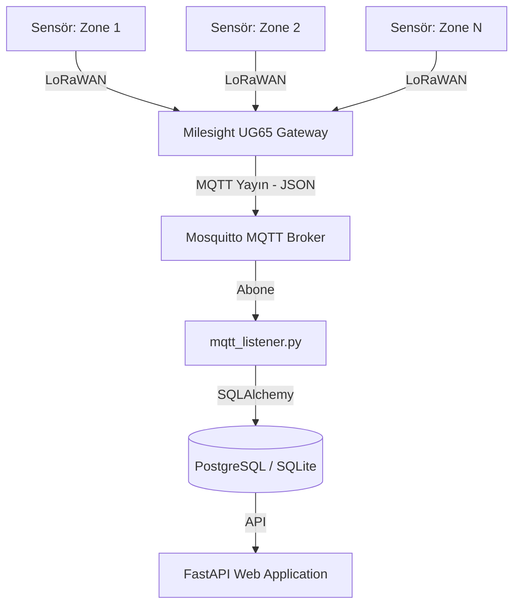

# Tavuk Çiftliği IoT ve Sensör Kurulum Rehberi

Bu belgede, kümes içi çevresel faktörleri takip eden IoT sensör mimarisi, sensör bağlantıları ve verilerin işlenme akışı açıklanmaktadır.

---

## 1. IoT ve Sistem Mimarisi

Sistem; LoRaWAN tabanlı uç sensörler, bir adet LoRaWAN Gateway, MQTT Broker, veri tabanı ve web servisinden oluşmaktadır.



- **Uç Sensörler (LoRaWAN):** Her bölgeye (Zone) konumlandırılmış sıcaklık, bağıl nem, amonyak ($NH_3$) ve karbondioksit ($CO_2$) ölçen entegre cihazlar.
- **Gateway (Milesight UG65):** Sensörlerden gelen LoRaWAN paketlerini çözer ve yapılandırılmış MQTT Broker üzerine JSON formatında yayınlar.
- **MQTT Broker (Eclipse Mosquitto):** Gateway ile backend servisi arasındaki kuyruk yönetimi.
- **MQTT Listener (`core/mqtt_listener.py`):** MQTT kuyruğunu dinleyen ve gelen verileri veri tabanına işleyen arka plan servisi.

---

## 2. Sensör Bağlantıları ve MQTT Payload Yapısı

Sensör verileri Gateway tarafından `farm/sensors/zone-<id>` (örneğin `farm/sensors/zone-1`) gibi alt konulara (sub-topic) yayınlanır.

### Örnek Gateway MQTT Payload Yapısı
```json
{
  "applicationID": "1",
  "applicationName": "AriotTest",
  "deviceName": "UG65_zone-1",
  "object": {
    "zone": "zone-1",
    "temperature": 33.4,
    "humidity": 53.2,
    "nh3": 4.3,
    "co2": 530
  }
}
```

---

## 3. Veri İşleme Akışı

Gelen MQTT mesajları [mqtt_listener.py](file:///d:/Antigravity/tavuk/core/mqtt_listener.py) içerisinde aşağıdaki adımlarla işlenir:

1. **Bağlantı & Abonelik:** Listener başlatıldığında tanımlı MQTT Broker adresine bağlanır ve ana konuya abone olur (`farm/sensors/#`).
2. **Payload Çözümleme:** Gelen mesaj JSON formatında ayrıştırılır:
   - Bölge ID'si payload'daki `zone` veya `zone_id` alanlarından okunur. Bulunamazsa MQTT konu başlığının son parçasından (örneğin `zone-1`) çıkarılır.
   - Çevresel veriler (`temperature`, `humidity`, `nh3`, `co2`) toplanır.
3. **Veritabanı Kaydı:** Ayrıştırılan veriler `IoTData` modeline dönüştürülerek veri tabanına (`tavuk.db` veya PostgreSQL) kaydedilir:
   ```python
   iot_record = IoTData(
       zone_id=zone_id,
       t_in=t_in,
       rh_in=rh_in,
       nh3_ppm=nh3_ppm,
       co2_ppm=co2_ppm
   )
   db.add(iot_record)
   db.commit()
   ```

---

## 4. Canlı Analiz ve Hesaplamalar

Kaydedilen veriler [biology.py](file:///d:/Antigravity/tavuk/core/biology.py) modülü tarafından periyodik olarak işlenerek canlı gösterge paneline yansıtılır:

- **Hatalı Sensör Filtreleme (Outlier Detection):** Birden fazla sensörün bulunduğu sistemlerde hatalı okumaları engellemek için standart sapma tabanlı aykırı değer analizi yapılır. Aykırı değer üreten sensörler uyarı alarmı oluşturur ve ortalamaya dahil edilmez.
- **Biyolojik ve Finansal Hesaplamalar:** 
  - Günlük canlı ağırlık artışı tahmini.
  - Sıcaklık ve gaz oranlarına bağlı olarak yem tüketim verimi (FCR - Feed Conversion Ratio) kaybı ve ölüm oranları tahmini.
  - Fan kapasiteleri ve çalışma sürelerine göre elektrik tüketim maliyeti.
